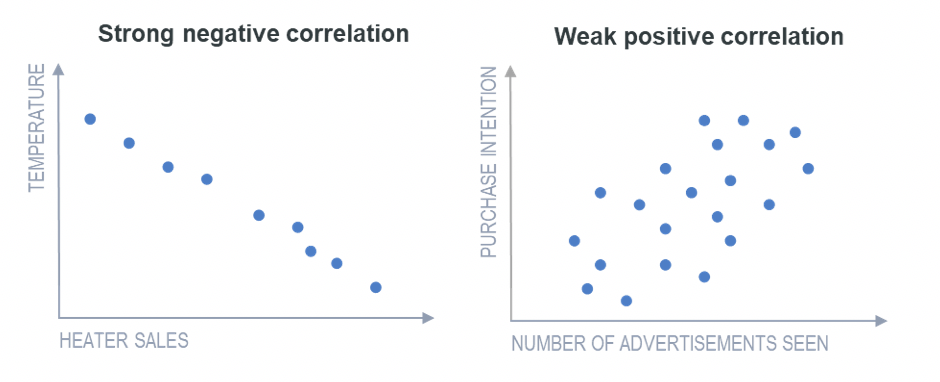

In this chapter we're going to use Python statistical libraries to begin to measure the correlation between various features in a dataset.

**Correlation** is the degree to which two or more attributes or measurements on the same group of elements show a tendency to vary together.

Correlations are some of the most common and obviously useful parts of analyzing data. What moves with what? Which variables are "dependent" and which are "independent"? So what are some questions that we might want to find correlations?

Let's take an elemental correlation:

1. Human weight correlates with human height. (Because bones are so heavy)
1. Size of vocabulary correlates with age up to adulthood, then the correlation evaporates.

What other common correlations can you think of?

> [info]
> Correlation vs. Causation
> Do not fall into the trap of mistaking correlation for causation. The rain falls, the plants grow, thats causation because there is a causal link between the water of the rain and the plants growing. On the other hand, did you know that the rates of violent crime and murder have been known to jump when ice cream sales do?
> Reference [HowStuffWorks—10 Correlations That Are Not Causations](https://science.howstuffworks.com/innovation/science-questions/10-correlations-that-are-not-causations.htm)

# Covariance vs. Correlation

Both of these words mean that two variables are dependent on each other, but they are subtly different:

"In simple words, both the terms measure the relationship and the dependency between two variables. “Covariance” indicates the direction of the linear relationship between variables. “Correlation” on the other hand measures both the strength and direction of the linear relationship between two variables." Reference: [Towards Data Science Article](https://towardsdatascience.com/let-us-understand-the-correlation-matrix-and-covariance-matrix-d42e6b643c22)

# Finding Correlations on the Titanic

Open up a new Jupyter Notebook called "Titanic Correlation"

Remember to add your standard imports:

```py
import pandas as pd
import numpy as np
import matplotlib.pyplot as plt
import scipy.stats as stats
```

And let's keep using the Pandas DataFrame for the Titanic Dataset.

```py
df = pd.read_csv('titanic.csv')
df.head()
```

Now what are some correlations we might look for?

1. Is there a correlation between age and fare price?
1. Is there a correlation between class and survival? Did rich people survive more than the working people?
1. Was there a correlation between age and survival? Did they really allow "women and children first"?
1. What about the passenger's sex and survival?

# Women and Children First

We all know the old trope that when a ship is sinking it is "women and children first" into the lifeboats. Did this old adage stay true on the Titanic? Did more women and children survive than grown men? Did people's sex, age, or class matter most on the Titanic for their survival?

If women and children survived more than men, there would be a positive correlation between survival and sex and survival and age.

We can find the correlation between any two features with the Pandas method `feature.corr(feature)`

```py
df['Survived'].corr(df['Age'])
#=> -0.07722109457217768
#=> -7.72%
```

Then we can check the correlation between Survived and Sex. Note the syntax is different here because we're comparing strings (`Sex`) with integers (`Survived`).

```py
df['Sex'].str.get_dummies().corrwith(df['Survived']/df['Survived'].max())
#=> female    0.543351
#=> male     -0.543351
#=> -54.3%
```

[`str.get_dummies`](https://pandas.pydata.org/pandas-docs/stable/reference/api/pandas.Series.str.get_dummies.html) creates dummy (integer) variables that correspond to the string values, and [`corrwith`](https://pandas.pydata.org/pandas-docs/stable/reference/api/pandas.DataFrame.corrwith.html) is another way to compute correlation when you need to do so between a mixture of rows and columns ([`corr`](https://pandas.pydata.org/pandas-docs/stable/reference/api/pandas.DataFrame.corr.html) just works with columns only).

```[info]
**NOTE**–Correlation is expressed as a number between -1 and 1, but correlation is not the probability that something occurs.
```

So what can we conclude?

# Interpreting Correlation

**Positive 1**—`1.000` means that there is a perfect, positive correlation between two features, as one feature goes up, the other goes up exactly in proportion. If there is a negative number

**Zero 1**—`0.000`  means there is no correlation positive or negative between two features. They move completely at random to one another.

**Negative 1**—`-1.000` means that there is a perfect, negative or inverse correlation between two features. As one feature goes up, the other goes down and vise versa.

* –1. A perfect negative (downward sloping) linear relationship
* –0.70. A strong negative (downward sloping) linear relationship
* –0.50. A moderate negative (downhill sloping) relationship
* –0.30. A weak negative (downhill sloping) linear relationship
* 0. No linear relationship
* +0.30. A weak positive (upward sloping) linear relationship
* +0.50. A moderate positive (upward sloping) linear relationship
* +0.70. A strong positive (upward sloping) linear relationship
* +1. A perfect positive (upward sloping) linear relationship

Reference [Investopedia—What Does a Negative Correlation Coefficient Mean?](https://www.investopedia.com/ask/answers/041015/what-does-negative-correlation-coefficient-mean.asp)

Graphically strong and weak correlation would look like this:



# Correlations Between Age and Sex

Since we computed the correlation between Sex and Survival (-54.3%), and Age and Survival (-7.72%), we can say a few things with confidence:

```
A passenger's being a man was strongly negatively correlated with his survival aboard the titanic.

A passenger's being older was very weakly negatively correlated with survival.
```

But "Age" is not "Children" is it? How do we find out if being under 16 improved your chance at survival? What was the probability that someone under 16 survived vs. someone over 16?

This question can only be answered using Probability, which we will do in the next chapter. For now, let's look at the **Correlation Matrix**.

# Pandas Correlation Matrix

We can use the Pandas method `.corr()` to find the **correlation matrix** between all the various features.

```py
df.corr()
```

If you apply `.corr()` directly to your dataframe, you see it returns all pairwise correlations between your columns; that's why you then observe 1s at the diagonal of your matrix (each column is perfectly correlated with itself). Reference [Stack Overflow](https://stackoverflow.com/questions/42579908/use-corr-to-get-the-correlation-between-two-columns)

Looking at this matrix, what were some of the strong correlations on the Titanic?

# Highlighting Correlation Matrix with Chart

To make the insights from our correlation matrix more readable, let's visualize this matrix in a table. To do so we need to add one more python library called `seaborn` that will round out our bag of tools. Seaborn allows you to make even more beautiful and colorful charts than matplotlib. So install Seaborn

```bash
$ pip3 install seaborn
```

Now we can use seaborn in our notebook to make a heatmap table of the correlation matrix:

```python
import seaborn as sn
import matplotlib.pyplot as plt

sn.heatmap(df.corr(), annot=True)
plt.show()
```

We can rapidly see the the strongest positive (Orange) and strongest negative correlations (Black). What are they?

We can conclude that there are strong positive correlations between SibSp and Parch—and that makes sense because children often have siblings, and parents and children often travel together. We can also see that Pclass and Fare are strongly negatively correlated—that makes sense because 1st class tickets are more expensive than lower class tickets, meaning as class goes down (closer to 1) the fare goes up. Finally Age and Pclass are moderately negatively correlated—since richer people are generally older.

# Removing a Column

Since the passengerId column is just noise in this chart, let's remove it. In the line above this chart, let's use Pandas' `.drop()` function.

```py
df = df.drop(['PassengerId'], axis=1)
```

That should make our heat map a little cleaner.

# No Text Columns

Notice that no string columns were included in our correlation heat map. That's not good! Let's convert the Sex column to an integer so it can be included in our correlation heatmap.

In a cell above our heat map let's loop over

```py
genders = {"male": 1, "female": 0}
data = [train_df, test_df]

for dataset in data:
    dataset['Sex'] = dataset['Sex'].map(genders)
```

Now rerun your heatmap. We see the same strong correlation between Sex and Survival!

In the next chapter we'll use probability to find some concrete insights from this hint in the form of a correlation.
